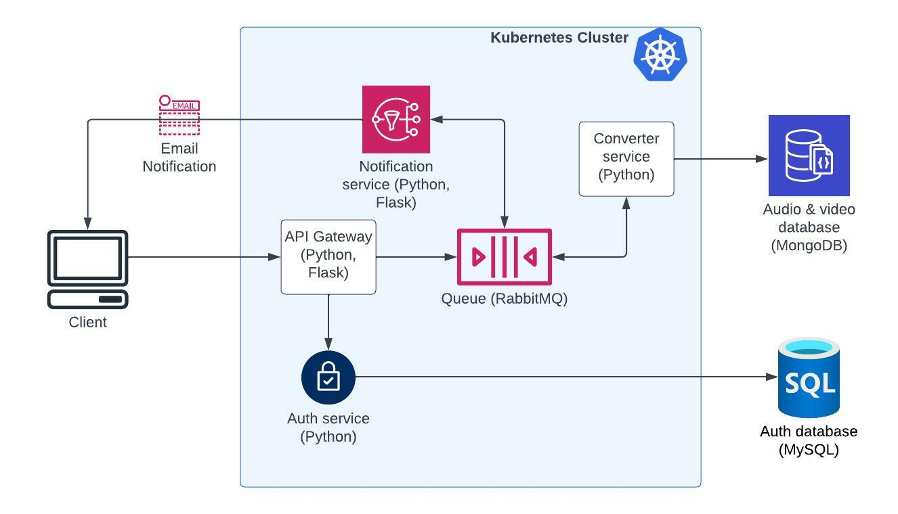

# Video to mp3 converter
## (microservice architecture study project)


This is a small application created to learn microservice architecture: Docker, Kubernetes, container, web services with Python, RabbitMQ, MongoDB, and others. 


I started by following the YouTube tutorial on freeCodeCamp.org channel, then builded up on it, adding more integrations. 





### Requirements
* MySQL
* MongoDB
* Kubernetes (Minikube is ok) with Ingress enabled
* added these lines to your `/etc/hosts` file:
```
127.0.0.1 rabbitmq-manager.com                                                 
127.0.0.1 mycrazymp3converter.com
```


### How to start
1. start Minikube
2. deploy all Kubernetes entities:
```
# inside python/src directory
kubectl deploy -f auth/manifests
kubectl deploy -f convert/manifests
kubectl deploy -f gateway/manifests
kubectl deploy -f notification/manifests
kubectl deploy -f rabbit/manifests
```
3. add `video` and `mp3` queues in `rabbitmq-manager.com` (default authentication guest/guest)


### How to use
1. login with default user and password from `init.sql` script
```
curl -X POST http://mycrazymp3converter.com/login -u mbyra.testing@gmail.com:Admin123
```
2. use returned token to upload a video file
```
curl -X POST -F 'file=@./converter/test.mp4' -H 'Authorization: Bearer <token>' http://mycrazymp3converter.com/upload
```
3. download mp3 file using id from email (email sent by default to the same address from `init.sql`):
```
curl --output mp3_dowload.mp3 -X GET -H 'Authorization: Bearer <token>' http://mycrazymp3converter.com/download?fid=<id from email>
```


### Notes
* If you want to modify any of .py files, you need to build new Docker image, tag it, push to your repo, and use your address in an appropriate service in `manifests` directories
```
docker build .
docker tag <tag> <your_username>/<your image name, e.g. gateway>:latest
docker push <your_username>/<your image name>:latest
```